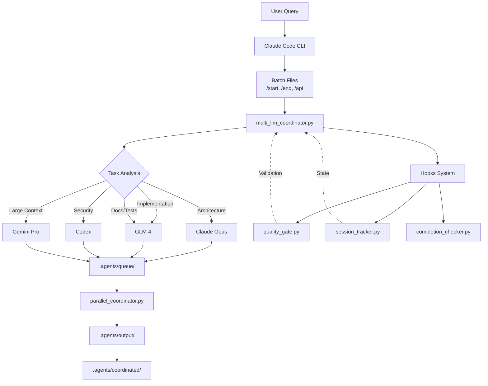
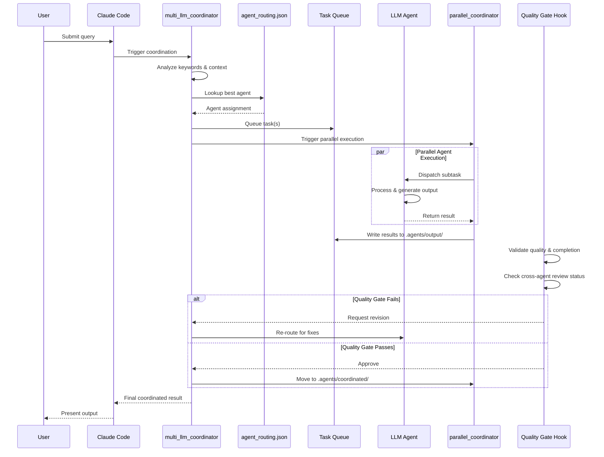

# Multi-LLM Orchestration System Architecture

## 1. System Overview



**Summary**: Claude Code CLI invokes batch files that trigger Python coordinators. Tasks are analyzed and routed to appropriate LLM agents (Opus, GLM-4, Codex, Gemini). Results flow through a queue system to parallel execution, then final outputs. Hooks provide quality control throughout.

---

## 2. File Structure Map

```
agent-coordinator/
├── commands/           # Slash commands for Claude Code (/start, /end, /api)
├── config/
│   ├── agent_routing.json      # Maps task types to specific LLM agents
│   └── hooks_settings.json     # Quality control hook configurations
├── hooks/
│   ├── core/                   # Critical validation (quality gates, completion checks)
│   ├── auxiliary/              # Helper utilities (root protection, etc.)
│   └── session/                # Session state tracking across agents
├── prompts/            # Agent-specific prompt templates
├── scripts/
│   ├── agent_coordinator.py    # Task tracking and status management
│   ├── multi_llm_coordinator.py # Task routing to appropriate LLMs
│   ├── parallel_coordinator.py # Concurrent task execution
│   ├── glm_direct.py          # GLM-4 API integration
│   ├── gemini_wrapper.py      # Gemini API integration
│   └── codex_wrapper.py       # Codex API integration
├── templates/          # Project initialization scaffolds
├── .agents/            # Runtime state (queue, output, coordinated results)
└── validate.py         # System health check script
```

**Component Roles**:
- **commands/**: User-facing CLI entry points
- **config/**: Centralized routing and behavior rules
- **hooks/**: Quality control and session persistence
- **scripts/**: Core orchestration logic
- **.agents/**: Transient runtime data (not committed)

---

## 3. Execution Flow



**Key Points**:
- Tasks are analyzed for keyword/context matching before routing
- Multiple agents can work in parallel on subtasks
- Quality gates can trigger revision loops
- Session state tracks what has been reviewed by whom

---

## 4. Data Flow

### Write Locations

| Data Type | Location | Format |
|-----------|----------|--------|
| Pending tasks | `.agents/queue/` | JSON task descriptors |
| Agent outputs | `.agents/output/[timestamp]/` | Result files |
| Final results | `.agents/coordinated/` | Aggregated outputs |
| Session state | `.claude/state/session_state.json` | Cross-agent context |
| Coordination log | `docs/coordination/COORDINATION.md` | Human-readable status |

### Result Processing Pipeline

```
Agent Output → Queue Collection → Parallel Aggregation → Quality Gate → Final Storage
```

1. **Collection**: Individual agent outputs written to timestamped directories
2. **Parsing**: `parallel_coordinator.py` reads and merges results
3. **Validation**: Hooks verify completion and cross-agent review requirements
4. **Session Update**: `session_tracker.py` records reviewer assignments
5. **Finalization**: Approved results moved to `.agents/coordinated/`

### Session State Storage

- **Location**: `.claude/state/session_state.json`
- **Purpose**: Prevents duplicate reviews, tracks which agents have reviewed which outputs
- **Rotation**: Automatic reviewer cycling (Claude → GLM → Codex → Claude)

---

## 5. Current Strengths & Weaknesses

### Strengths

- **Intelligent Routing**: Tasks automatically matched to best-suited LLM based on content analysis
- **Parallel Execution**: Multiple agents work concurrently on different aspects
- **Quality Gates**: Built-in validation prevents incomplete or low-quality outputs
- **Session Awareness**: Cross-agent state tracking prevents redundant reviews
- **Extensible**: New agents and routing rules added via JSON config

### Weaknesses

- **File-Based Coordination**: Relies on file system for queuing (could bottleneck at scale)
- **No Deadlock Detection**: Parallel tasks could potentially create circular dependencies
- **Hardcoded Routing**: Keyword matching in `agent_routing.json` requires manual updates
- **Limited Observability**: No centralized dashboard for real-time task monitoring
- **Single-Host Design**: Not designed for distributed execution across machines
