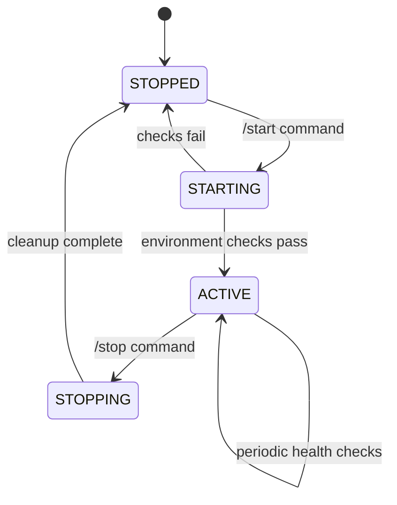

# State Management & Lifecycle Design

## State Diagram



---

## 1. State Schema

**Location:** `.claude/agent-coordinator/runtime/state.json`

```json
{
  "status": "STOPPED|STARTING|ACTIVE|STOPPING",
  "started_at": "2025-12-26T02:30:00Z",
  "version": "1.0.0",
  "active_agents": ["glm-4.7", "codex"],
  "last_update_check": "2025-12-26T02:30:00Z",
  "environment": {
    "glm_available": true,
    "codex_available": true,
    "gemini_available": false,
    "zai_endpoint": "https://api.z.ai/api/anthropic"
  },
  "stats": {
    "tasks_completed": 0,
    "tasks_failed": 0,
    "total_agents_spawned": 0
  }
}
```

---

## 2. State Manager Skeleton

**File:** `scripts/state_manager.py`

```python
class StateManager:
    """Manages agent coordinator lifecycle and state"""

    # Properties
    - state_file: Path          # Location of state.json
    - runtime_dir: Path         # .claude/agent-coordinator/runtime/
    - agents_dir: Path          # .agents/

    # Core Methods
    + load_state() -> dict
    + save_state(state: dict)
    + get_status() -> str       # Returns current status

    # Lifecycle
    + start() -> bool           # Run startup sequence
    + stop(timeout: int) -> bool # Run shutdown sequence
    + is_active() -> bool

    # Environment
    + verify_environment() -> dict  # Returns availability map
    + check_glm() -> bool       # Quick API test
    + check_codex() -> bool
    + check_gemini() -> bool

    # Updates
    + check_updates() -> dict   # GitHub release check
    + get_version() -> str

    # Agents
    + register_agent(name: str)
    + unregister_agent(name: str)
    + get_active_agents() -> list
```

---

## 3. Startup Sequence (`/start`)

1. **Load current state**
   - Read `state.json`
   - If already ACTIVE, exit with message

2. **Set status to STARTING**
   - Update state file
   - Record start time

3. **Environment verification**
   - Check `~/.config/secrets/ai.env` exists
   - Verify `ANTHROPIC_BASE_URL` contains "z.ai"
   - Verify `ANTHROPIC_AUTH_TOKEN` is set
   - Quick API call to Z.ai (expect GLM response)

4. **Create directory structure**
   ```
   .agents/
   ├── queue/          # Pending tasks
   ├── output/         # Individual agent results
   ├── coordinated/    # Final aggregated outputs
   └── logs/           # Agent execution logs
   ```

5. **Detect available agents**
   - GLM: via Z.ai endpoint check
   - Codex: check if binary exists
   - Gemini: check for API key
   - Update `environment` section in state

6. **Check for updates** (non-blocking)
   - Fetch latest release from GitHub
   - Compare with local version
   - Print notification if update available

7. **Set status to ACTIVE**
   - Update state file
   - Print readiness message with available agents

---

## 4. Stop Sequence (`/stop`)

1. **Load current state**
   - Read `state.json`
   - If not ACTIVE, exit with message

2. **Set status to STOPPING**
   - Update state file
   - Prevent new agent spawns

3. **Wait for active agents**
   - Check `active_agents` list
   - Poll every 2 seconds
   - Max wait: 30 seconds
   - Force stop after timeout

4. **Archive session**
   - Copy `state.json` to `.agents/logs/session-{timestamp}.json`
   - Generate usage summary

5. **Set status to STOPPED**
   - Clear `active_agents`
   - Update state file

6. **Print summary**
   - Tasks completed/failed
   - Total agents spawned
   - Session duration

---

## 5. Update Check Logic

**Pseudocode:**

```
FUNCTION check_updates():
    remote = GET("https://api.github.com/repos/CarlosIrineuCosta/agent-system/releases/latest")
    remote_version = remote.tag_name

    local = read_file("VERSION") or state.version

    IF remote_version > local_version:
        PRINT "Update available: {local} -> {remote_version}"
        PRINT "Run: cd ~/Storage/projects/agent-coordinator && git pull"
        RETURN {"available": true, "current": local, "latest": remote_version}
    ELSE:
        PRINT "System up to date ({local})"
        RETURN {"available": false, "current": local}

    UPDATE state.last_update_check = now()
```

**Triggers:**
- Run on `/start` (non-blocking, doesn't fail start if GitHub unreachable)
- Can be triggered manually via `/check-updates`

---

## 6. Environment Checks

### Startup Verification Checklist

| Check | Method | Fail Action |
|-------|--------|-------------|
| `ai.env` exists | `Path("~/.config/secrets/ai.env").exists()` | Error: "Run setup to configure" |
| `ai.env` sourced | Check if `ANTHROPIC_AUTH_TOKEN` is set | Error: "Source ai.env in shell" |
| Z.ai endpoint | `ANTHROPIC_BASE_URL` contains "z.ai" | Error: "Wrong endpoint configured" |
| API token valid | Quick test call to Z.ai | Warning: "GLM unavailable" |
| `.agents/` exists | Create if missing | Auto-create |
| Codex available | `which codex` returns path | Set `codex_available: false` |
| Gemini available | `GEMINI_API_KEY` in env | Set `gemini_available: false` |

### Health Check (`/status`)

**Output format:**

```
Agent Coordinator Status
========================
Status: ACTIVE
Version: 1.0.0
Started: 2025-12-26 02:30:00
Uptime: 45 minutes

Available Agents:
  - GLM-4.7 (via Z.ai) ✓
  - Codex ✓
  - Gemini ✗ (no API key)

Current Tasks:
  - Active agents: 0
  - Completed: 12
  - Failed: 0

Environment:
  - Endpoint: https://api.z.ai/api/anthropic
  - Config: ~/.config/secrets/ai.env
```

---

## 7. Error Handling

| Scenario | Action |
|----------|--------|
| `state.json` corrupt | Rebuild from defaults, log error |
| GitHub unreachable | Continue startup, log warning |
| Z.ai API timeout | Set `glm_available: false`, continue |
| Interrupt during stop | Force stop after 30s timeout |
| Directory creation fails | Error out with permissions message |

---

## 8. File Structure

```
.claude/
└── agent-coordinator/
    └── runtime/
        ├── state.json          # Current state (created on start)
        └── logs/               # Archived session states

.agents/                        # Created on start
├── queue/                      # Pending tasks
├── output/                     # Individual agent results
├── coordinated/                # Final outputs
└── logs/                       # Agent execution logs
```

---

## Next Steps

1. Implement `state_manager.py` based on skeleton
2. Create `/start` command in `commands/`
3. Create `/stop` command in `commands/`
4. Create `/status` command in `commands/`
5. Add VERSION file to project root
6. Test startup sequence with actual environment
